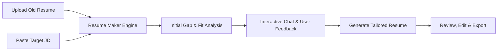

# Resume Maker - Product Overview

## 1. Introduction
**Resume Maker** is an AI-powered resume tailoring and optimization platform designed to bridge the gap between a candidate's existing experience and the specific requirements of target job opportunities. 

By analyzing an existing resume alongside a target Job Description (JD), Resume Maker provides an intelligent, conversational environment where candidates can iteratively modify and adapt their resume to maximize relevance, highlight matching competencies, and optimize for Applicant Tracking Systems (ATS).

---

## 2. Problem Statement
Job seekers often face significant hurdles when applying for jobs:
- Generic resumes fail to pass automated ATS filters or capture recruiter attention.
- Manually tailoring a resume for every unique job application is tedious and time-consuming.
- Candidates struggle to articulate how their past achievements map to the specific language and expectations of a new role.

---

## 3. Product Vision & Solution
Resume Maker transforms the resume adaptation process into a guided, interactive collaboration:
1. **Source Resume Intake**: Candidates provide their current or legacy resume (document upload or text).
2. **Target Role Definition**: Candidates provide the target Job Description (JD) they are aiming for.
3. **Conversational Refinement**: Candidates use an intuitive chat input to instruct the AI on specific edits, highlights, tone adjustments, or constraints.
4. **Tailored Generation**: The application intelligently aligns the candidate's skills, accomplishments, and keywords with the JD requirements without falsifying experience.

---

## 4. Key Features

### 4.1. Dual-Input Context Engine
- **Existing Resume Ingestion**: Supports parsing standard formats (PDF, DOCX, Markdown, plain text) to extract work history, education, skills, and projects.
- **Job Description Analysis**: Extracts core competencies, required tech stack, domain qualifications, and ATS keywords from the target role.

### 4.2. Interactive Chat & Prompt-Based Editing
- **Conversational Guidance**: Dedicated chat interface allowing users to issue natural language instructions (e.g., *"Emphasize my cloud architecture experience for this DevOps role"*, *"Shorten the summary to 3 punchy sentences"*, *"Highlight Python and Kubernetes projects"*).
- **Context-Aware Recommendations**: The AI suggests potential improvements, skill callouts, and phrasing enhancements based on gaps detected between the resume and JD.

### 4.3. Intelligent Alignment & ATS Optimization
- **Keyword & Semantic Mapping**: Synthesizes relevant industry terminology and action verbs tailored directly to the JD.
- **Impact-Driven Phrasing**: Rewrites bullet points to highlight measurable business impact and achievements (e.g., STAR/XYZ formats).
- **Truthfulness Guardrails**: Enhances relevant qualifications while maintaining the authenticity of the candidate's actual history.

### 4.4. Comparison & Export
- **Side-by-Side Diff View**: Visual comparison showing original text vs. tailored recommendations.
- **Multiple Export Formats**: Clean, ATS-friendly downloads in PDF, DOCX, and Markdown formats.

---

## 5. User Journey / Workflow

1. **Step 1: Input Data**
   - User uploads their current resume.
   - User inputs the target Job Description (paste text or link).
2. **Step 2: Analysis & Gap Detection**
   - The system analyzes match score, key missing keywords, and transferable skills.
3. **Step 3: Interactive Modification**
   - The user inputs specific prompts and preferences via the chat interface.
4. **Step 4: AI Transformation**
   - Resume Maker rewires section summaries, experience bullets, and skills to align with the JD.
5. **Step 5: Review & Download**
   - User reviews changes, requests any further refinements in chat, and exports the final ATS-ready resume.
